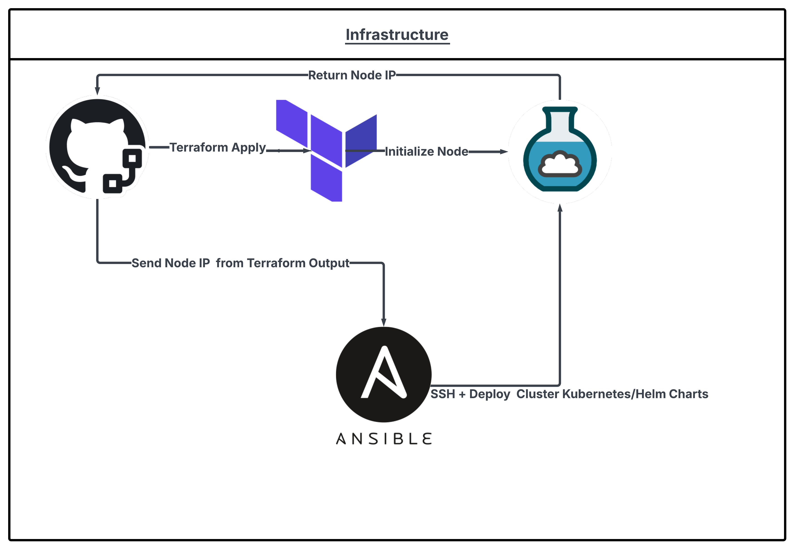
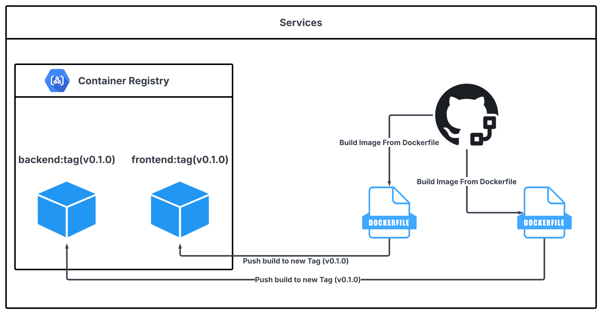
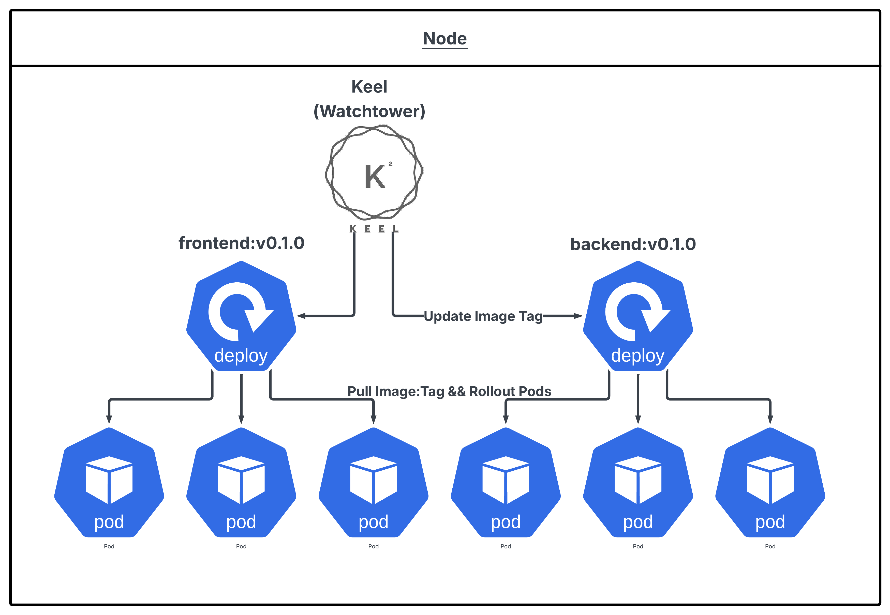
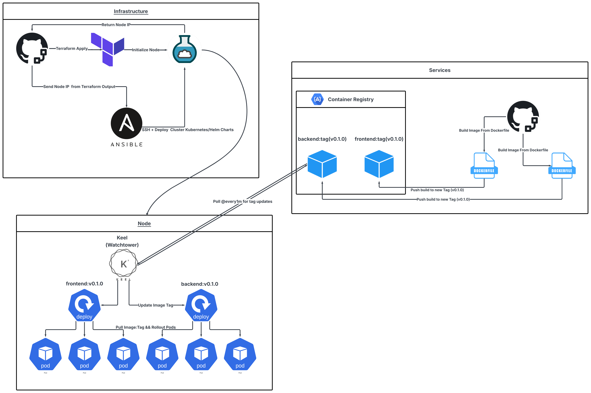

# CI/CD Architecture on CloudLab

Split into 3

## Infrastructure: Terraform & Ansible

**Goal:** Automate environment setup of CloudLab experiments + Deploy base cluster components.

**Flow:**

1. GitHub triggers Terraform to apply infrastructure definitions.
2. Terraform provisions the CloudLab node and returns its IP.
3. Terraform output feeds into Ansible.
4. Ansible SSHs into the node, installs dependencies (I.E Kubernetes, Helm, CRI, Rancher, etc..), and deploys the base cluster components.

**Diagram:**

---

## Continuous Integration: GitHub Actions

**Goal:** Build and publish versioned container images automatically for every change.

**Flow:**

1. Developer pushes code to GitHub.
2. GitHub Actions builds Docker images for both the frontend and backend.
3. Each image is tagged (e.g., `v0.1.0`) and pushed to the GitHub Container Registry (GHCR).
4. These image tags act as versioned release artifacts for the cluster.

**Diagram:**

---

## Continuous Delivery: Keel in Kubernetes

**Goal:** Automate application updates within the Kubernetes node without manual redeploys.

**Flow:**

1. Keel runs inside the cluster and polls the container registry for new image tags.
2. When a new tag is detected, Keel patches the corresponding Deployment with the updated image tag.
3. Kubernetes performs a rolling update, pulling the new image and replacing existing pods.
4. The process ensures zero-manual intervention between build and deployment.

**Diagram:**

---

## Full System Integration: End-to-End Flow

**Conceptual Overview:**

- Terraform and Ansible define and configure the environment.
- GitHub Actions handles Continuous Integration by building and pushing versioned images.
- Keel provides Continuous Delivery, automatically updating deployments inside the cluster.

**Diagram:**

---
